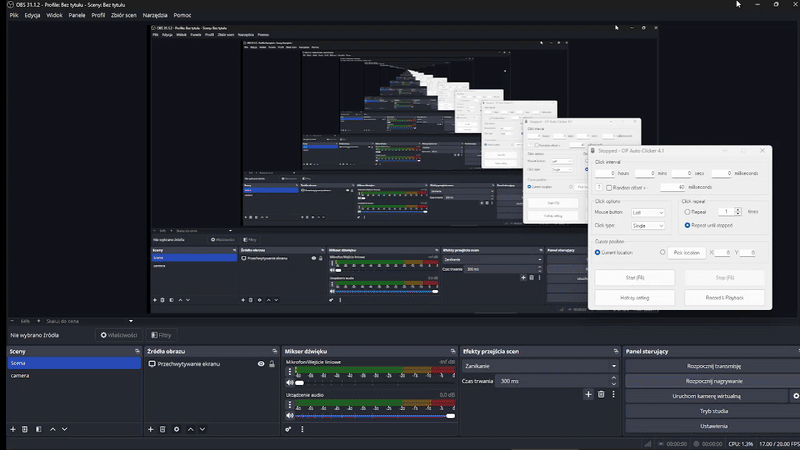
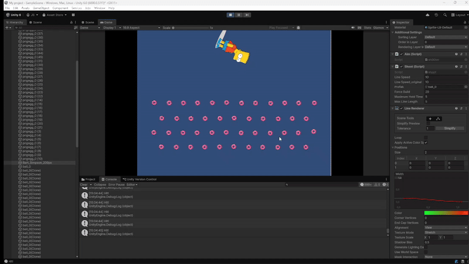
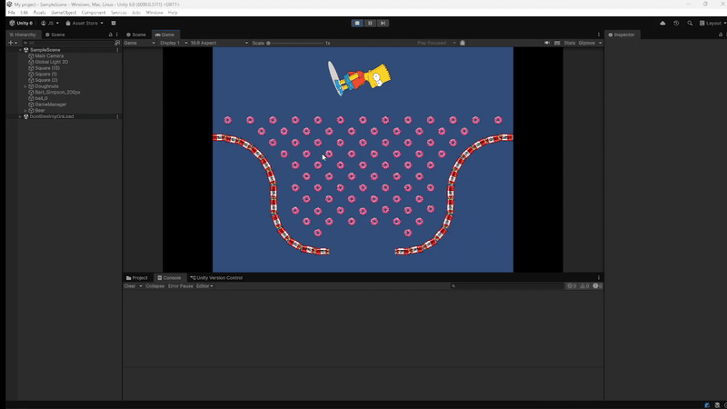
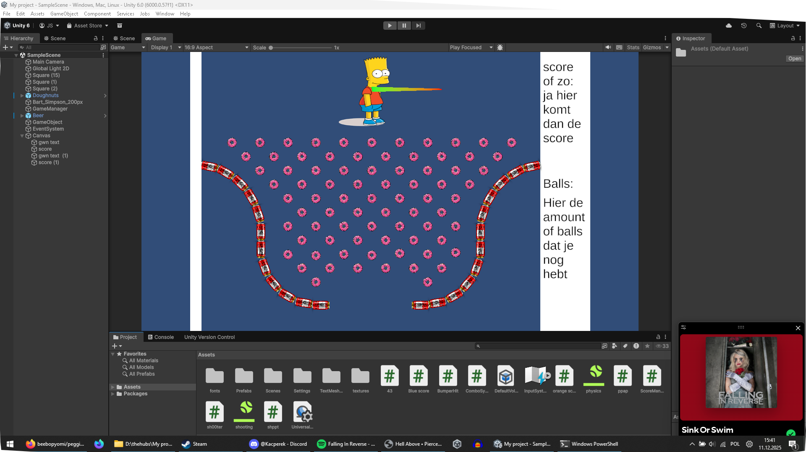

# pegging

# (SCRAPPED IDEA)

pegging game idee rythem game type shit idk improv of zo help

dus soort van die platformen hebben collistion en like die balk daar onder gaat vol worden en recht waneer hij vol is moet je schieten en het idee is dat hij vol is op de beat van de song en die ballen verschijnen een voor een en je moet de laatste ball schieten die op ge popot is en als je em niet raakt dan gaat ie niet weg en staat hij in de weg.

-----------------------------------------------------  

# NEW IDEA

gewoon peggle maar dan simpsons en beter.

-----------------------------------------------------  

# 09:51 1-12-2025

dus uhh ik heb collision en zo geadd en je kan springen...

me dinges werkt well ok ik ben well een beetje achter maar ik catch up dw gang

[spring command](Assets/ppap.cs)

[orange collision command](https://github.com/beebopyomi/pegging/blob/main/Assets/orange%20score.cs)
[Blue collision command](https://github.com/beebopyomi/pegging/blob/main/Assets/Blue%20score.cs)

-------------------------------------------------------------------

# 10:07 1-12-2025

Scrap de rythem game idea het word gwn simpson themed peggle

-------------------------------------------------------------------

# 11:03 1-12-2025

alles werkt top ik kan schieten en mikken en whatever

-------------------------------------------------------------------

# 14:13 2-12-2025

ik heb deze unity project gebruik voor mijn github les. 

de instructie zij "Copieer de url van jouw online repository van een unityproject en lever deze in bij simulise"

specefiek de woorden "EEN UNITYPROJECT". dat betekent dat het een random project kan zijn! deze is de beste dus yeye.

-------------------------------------------------------------------

# 14:20 3-12-2025

forced a 4:3 aspect ratio to make it more lore acurate.

i dont like the way we are making peggele in our class, its not lore acurate.

they said we could give it our own twist and my twist will be making it more lore accurate.

-------------------------------------------------------------------

# 15:06 3-12-2025

Line rendere is added en ik zat er lang mee te kloten, moest ook ff wat eten dus yeye maar hier is de giffy vro

-------------------------------------------------------------------

# 17:41 3-12-2025

lang niet geupdate... ik heb veel dingen gedaan, in peggle heb je blauwe en orange pegs, die geven verschilende amounts of punten, dat heb ik nu ook.

duff beer geeft 100 punten
doughnut geeft 10 punten

[4:3 aspect ratio script](Assets/43.cs)

-------------------------------------------------------------------

# 15:41 11-12-2025

dus dit is hoe de UI er uit gaat zien.

ik will ook nog wat visuals doen zo als dat je letterlijk ziet hoeveel ballen je hebt in een box en dat als je der een gebruikt dat de ding dan weg gaat uh dat er eentje weg gaat dat bedoel ik okalweer sorry.

-------------------------------------------------------------------

# 15:21 06-01-2026

ik probeerde gebuild toe teveogen maar het erm werkte niet eens, de start menu ook 😭

-------------------------------------------------------------------

# 16:19 06-01-2026

De eerste beta is online! voor macos, windows en linux. we doen niet aan operating system discriminatie dus iedereen mag het probeeren :)

succces en fijne kerst en nieuwjaar mensen!

-------------------------------------------------------------------

# 11:27 22-01-2026

ok het word nu teto miku en neru peggle omdat waarom niet

-------------------------------------------------------------------

# 12:29 22-01-2026

het word gwn zo een 2000's larp game ik ben er klaar mee.

may the larp be with you fella
