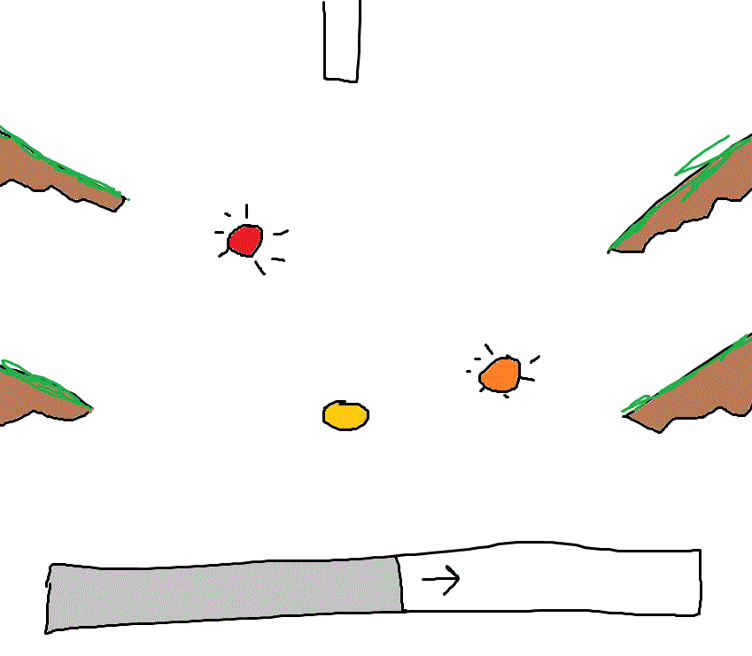
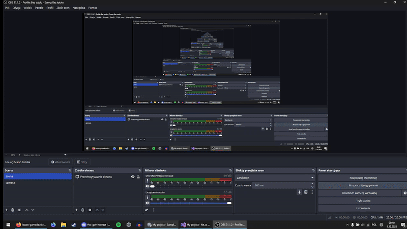

# pegging
pegging game idee rythem game type shit idk improv of zo help

dus soort van die platformen hebben collistion en like die balk daar onder gaat vol worden en recht waneer hij vol is moet je schieten en het idee is dat hij vol is op de beat van de song en die ballen verschijnen een voor een en je moet de laatste ball schieten die op ge popot is en als je em niet raakt dan gaat ie niet weg en staat hij in de weg.

-----------------------------------------------------  

09:51 1-12-25

dus uhh ik heb collision en zo geadd en je kan springen...

me dinges werkt well ok ik ben well een beetje achter maar ik catch up dw gang

[spring command](Assets/ppap.cs)

[collision command](Assets/hit.cs)

-------------------------------------------------------------------

10:07 1-12-25

Scrap de rythem game idea het word gwn simpson themed peggle

-------------------------------------------------------------------

11:03 1-12-25

alles werkt top ik kan schieten en mikken en whatever
